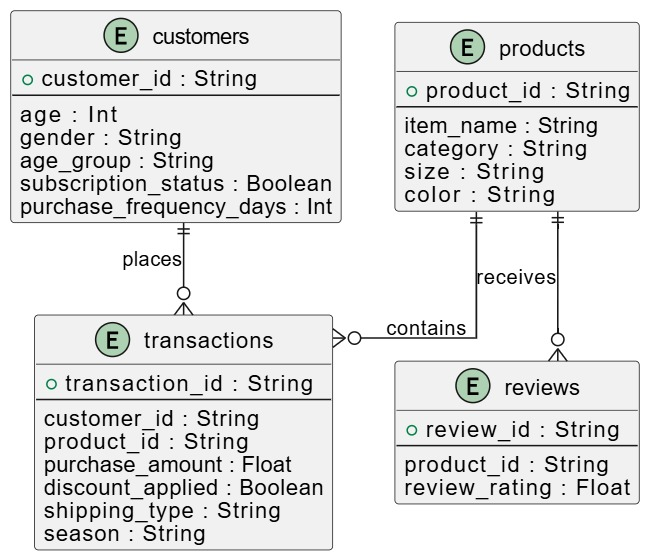
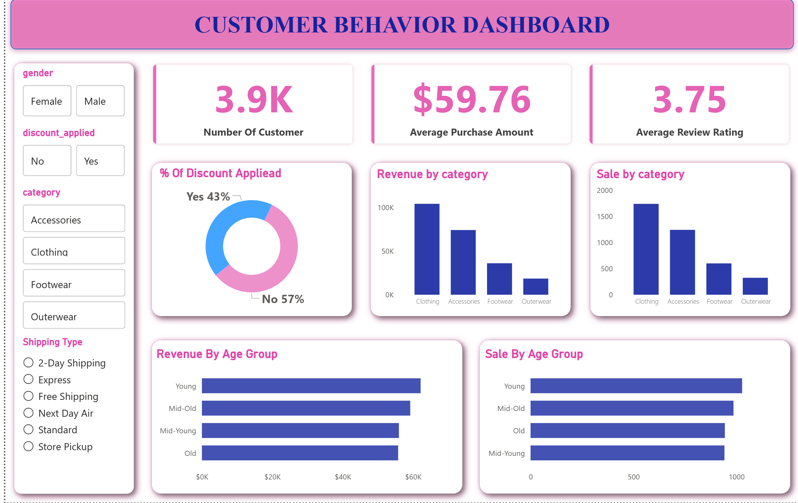
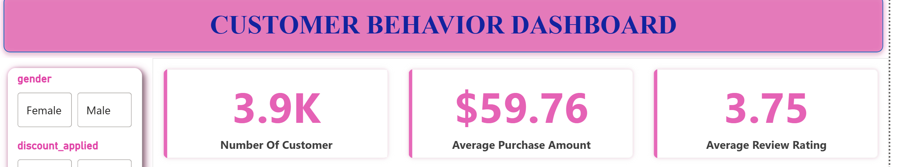
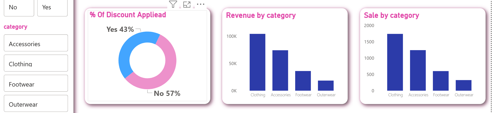
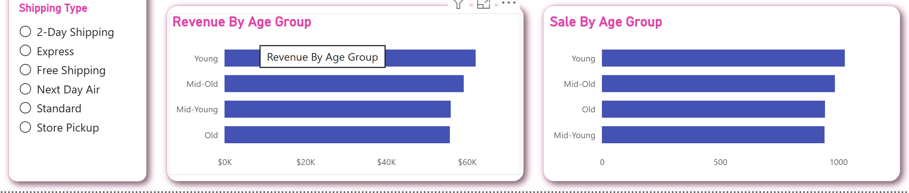

#  Customer Behavior Analysis  
### Retail Revenue Intelligence & Customer Segmentation  

<p align="left">

[](OnlineShopingAnalyse.ipynb)
[](sale_good_project.sql)
[](analytic_customer_behavior.pbix)


</p>

---

##  Table of Contents

- [Project Background](#project-background)
- [Data Preparation & Structure](#data-preparation--structure)
- [Executive Dashboard Overview](#executive-dashboard-overview)
- [Insights Deep Dive](#insights-deep-dive)
- [Strategic Recommendations](#strategic-recommendations)
- [Assumptions & Caveats](#assumptions--caveats)
- [Repository Structure](#repository-structure)

---

# Project Background

The company is a multi-category retail business operating across:

- Clothing  
- Accessories  
- Footwear  
- Outerwear  

Management identified that transactional data (3,900 purchase records, 18 variables) was underutilized and lacked structured analytical interpretation.  

As a **Data Analyst** , my objective was to transform raw customer transactions into business intelligence supporting:

- Revenue optimization  
- Discount strategy refinement  
- Customer loyalty strengthening  
- Demographic-based targeting  

This project combines **Python (data preparation), MySQL (business analysis), and Power BI (executive reporting)**.

---

# Data Preparation & Structure

### Dataset Overview

- 3,900 transactions  
- 18 structured fields  
- Demographics, purchasing behavior, product attributes, discounts, subscription status, review ratings  

### Data Cleaning Actions

- Identified **37 missing values** in `review_rating`
- Imputed missing values using median per product category
- Standardized column names to `snake_case`
- Engineered:
  - `age_group`
  - `purchase_frequency_days`
- Removed redundant column (`promo_code_used`)
- Loaded clean dataset into MySQL for structured analysis

  <p align="center">
  
</p>

---

# Executive Dashboard Overview

<p align="center">
  
</p>

The Power BI dashboard provides an executive-level overview of customer behavior and revenue distribution. It enables dynamic filtering by:

- Gender  
- Discount Applied  
- Product Category  
- Shipping Type  

Below is how each dashboard component supports strategic analysis.

---

## 🔢 KPI Panel (Top Metrics)

The dashboard headline metrics summarize business performance:

- **3.9K Customers** → Total analyzed customer base  
- **$59.76 Average Purchase Amount** → Stable transaction value  
- **3.75 Average Review Rating** → Moderate satisfaction level  

These indicators provide an immediate snapshot of scale, spending intensity, and customer sentiment.
<p align="center">
  
</p>

---

## 💸 Discount Penetration (Donut Chart)

- **43% of transactions involve discounts**
- 57% occur without promotional incentives

This confirms heavy reliance on discount-driven purchasing behavior.  
It signals potential margin sensitivity and emphasizes the need for targeted promotional strategies.

---

## 🏷 Revenue by Category (Bar Chart)

Revenue concentration is clearly visible:

- Clothing ≈ $100K  
- Accessories ≈ $70K  
- Footwear ≈ $30K  
- Outerwear ≈ $10K  

Clothing and Accessories dominate total revenue, indicating category dependency and marketing prioritization opportunity.

<p align="center">
  
</p>
---

## 📦 Sales by Category

Sales volume mirrors revenue trends:

- Clothing leads in total units sold  
- Accessories follow  
- Footwear and Outerwear lag  

This confirms dominance is volume-driven rather than price distortion.

---

## 👥 Revenue by Age Group

Revenue contribution across demographics:

- Young ≈ $62K  
- Mid-Old ≈ $59K  
- Mid-Young ≈ $56K  
- Old ≈ $55K  

Revenue distribution is relatively balanced across age groups, with slight dominance among younger customers.

This suggests opportunity for personalized but broad demographic targeting.

<p align="center">
  
</p>

---

## 📊 Sales by Age Group

Sales distribution aligns with revenue patterns, indicating:

- Younger customers contribute slightly more transactions
- No extreme demographic imbalance

This supports cross-generational marketing strategies.

---

# Insights Deep Dive

---

## 1️⃣ Revenue & Customer Contribution

### Revenue by Gender

- Male Revenue: **$157,890**
- Female Revenue: **$75,191**

Male customers generate significantly higher total revenue, despite similar average purchase values — suggesting higher transaction frequency.

---

## 2️⃣ Product Performance & Ratings

### Top Rated Products

- Gloves — 3.86  
- Sandals — 3.84  
- Boots — 3.82  
- Hat — 3.80  
- Handbag — 3.78  

Ratings are consistent across top items, indicating stable product satisfaction levels.

### Top Products per Category

- Accessories: Jewelry, Sunglasses, Belt  
- Clothing: Blouse, Pants, Shirt  
- Footwear: Sandals, Shoes, Sneakers  
- Outerwear: Jacket, Coat  

These represent high-demand SKUs within each category.

---

## 3️⃣ Discount Sensitivity

Top discount-dependent products:

- Hat — 50%  
- Sneakers — 49.66%  
- Coat — 49.07%  
- Sweater — 48.17%  
- Pants — 47.37%  

Certain products approach 50% discount reliance, reinforcing promotional sensitivity risk.

---

## 4️⃣ Loyalty & Subscription Dynamics

### Customer Segmentation

- New: 83  
- Returning: 701  
- Loyal: 3,116  

The majority of revenue is driven by loyal customers, indicating strong retention but dependency risk.

### Subscriber vs Non-Subscriber Revenue

- Subscriber Revenue: **$62,645**
- Non-Subscriber Revenue: **$170,436**

Subscription penetration remains under-optimized relative to loyal customer volume.

### Repeat Buyers & Subscription

Among customers with >5 purchases:

- Subscribed: 958  
- Not Subscribed: 2,518  

Clear opportunity exists to improve subscription conversion.

---

# Strategic Recommendations

Based on dashboard insights and SQL analysis, the Marketing and Revenue Strategy teams should:

- Prioritize investment in Clothing and Accessories due to revenue concentration.
- Replace blanket discounts with targeted promotional campaigns.
- Develop structured subscription conversion programs for repeat buyers.
- Improve customer experience to increase review rating above 4.0.
- Implement demographic-based personalization strategies.

---

# Assumptions & Caveats

- 37 missing review ratings were imputed using median per category.
- Profit margin data was unavailable; analysis focuses on revenue.
- Seasonal breakdown was not deeply segmented.
- Discount impact measured at transaction level, not net margin level.

---

# Repository Structure

```
customer-behavior-analysis/
│
├── data/
├── sql/
│   ├── data_cleaning.sql
│   └── business_queries.sql
├── notebooks/
│   └── data_preparation.ipynb
├── images/
├── dashboard/
└── README.md
```

---

# Author

**Djibe Christian Diguina**  
Junior Data Analyst  
SQL • Python • Business Intelligence
